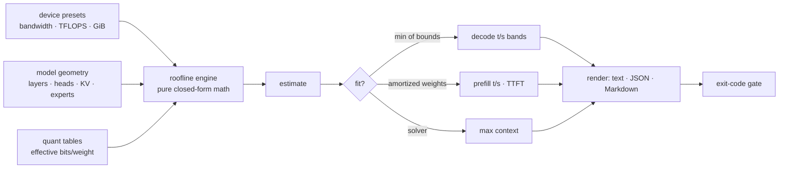

# inferest

[English](README.md) | [中文](README.zh.md) | [日本語](README.ja.md)

[](LICENSE) [](go.mod) [](CHANGELOG.md)  [](CONTRIBUTING.md)

**inferest：デバイスのメモリ帯域・演算性能とモデル形状から LLM 推論の tokens/s 上下界を見積もるオープンソースのゼロ依存 CLI——閉形式の roofline 数学だから、ハードを買わず、モデルをダウンロードせずにサニティチェックできる。**


```bash
git clone https://github.com/JaydenCJ/inferest && cd inferest
go build -o inferest ./cmd/inferest    # single static binary, stdlib only
```

> プレリリース：v0.1.0 はまだパッケージレジストリに公開していません。上記のとおりソースからビルドしてください（Go ≥1.22 で可）。

## なぜ inferest？

ローカル LLM 推論のハード選びはベンダーの宣伝とフォーラムの噂で動いていますが、支配する物理は拍子抜けするほど単純です：トークンを 1 つ生成するには、アクティブな重み全バイトと KV キャッシュ全体をメモリから流し込む必要があるため、デコード速度は*メモリ帯域 ÷ トークンあたりバイト数*であり、バッチ処理される prefill は*演算性能 ÷ トークンあたり FLOPs*です。ベンチマークハーネスは正確に答えます——ただし GPU を買い、40 GB の重みを落とし、ランタイムをビルドした後で。オンラインの VRAM 計算機は即答しますが「載るかどうか」だけで速度には沈黙し、スペック表のスパース版マーケティング TFLOPS はそもそもデコードの律速になりません。inferest は誰も出荷しなかった中間路線です：デバイスの 3 つの数字とモデル形状だけから、*メモリ適合・デコード t/s・prefill t/s・初回トークン遅延*を、保守/期待/楽観の正直なレンジと律速要因の名前つきで、ミリ秒で、オフラインで導出します——そのハードがまだ店頭にあっても。HPC エンジニアが信頼する roofline 数学を、購買判断ツールに仕立てたものです。

| | inferest | ランタイム系ベンチ | オンライン VRAM 計算機 | スペック表の当て推量 |
|---|---|---|---|---|
| ハードを所有せずに使える | ✅ | ❌ | ✅ | ✅ |
| モデルのダウンロード不要 | ✅ | ❌ | ✅ | ✅ |
| 適合だけでなくデコード*速度*を予測 | ✅ | ✅ 実測 | ❌ | ⚠️ 誤った律速 |
| decode / prefill / TTFT を分離 | ✅ | ✅ | ❌ | ❌ |
| 正直な不確実性レンジ | ✅ | n/a | ❌ | ❌ |
| 載る最大コンテキストを解く | ✅ | ❌ | ⚠️ 一部 | ❌ |
| スクリプト対応（JSON + 終了コードゲート） | ✅ | ⚠️ まちまち | ❌ | ❌ |
| ランタイム依存 | 0 | ランタイム + モデル | ブラウザ | 0 |

<sub>2026-07-12 時点で確認：inferest は Go 標準ライブラリのみを import。典型的なベンチ実行には推論ランタイム、GPU ツールチェーン、モデル重み一式が必要。</sub>

## 特長

- **実測ではなく閉形式** — すべての数字は帯域・TFLOPS・メモリ・形状から導出。ダウンロードもウォームアップも不要で、ミリ秒で答えが出る。
- **2 つの屋根を正直にラベル付け** — デコードは帯域律速と演算律速の両方を示し、最小値を採り、律速要因と余裕倍率を明記（ネタバレ：典型的な GPU では帯域が約 25 倍差で勝つ）。
- **不確実性を機能として** — 保守 / 期待 / 楽観レンジ（公称帯域の 55–85%、MFU 25–55%）。較正根拠は `docs/method.md`。自分のスタックを実測したら `--bw-eff`/`--mfu` で単一値に畳める。
- **メモリ適合ソルバー** — 重み（ブロックオーバーヘッド込みの実効 bits/weight）、トークンあたり KV キャッシュ、文書化されたオーバーヘッドモデル。載る最大コンテキストを解き、`fit` は不適合時に終了コード 1 を返すのでシェルのゲートに使える。
- **GQA・MHA・MoE を理解** — KV キャッシュは実際のヘッド形状から算出。MoE は占有（全エキスパート）と流量（ルーティングされた分）を分離——総 47B の MoE が 13B 並みにデコードできる理由そのもの。
- **反論できるプリセット** — 公開スペック表由来の 19 デバイスと、公称パラメータ数を自身の形状からの導出とテストで突き合わせる 11 モデルクラス。どの数字も実行ごとに上書き可能。
- **ゼロ依存・完全オフライン** — Go 標準ライブラリのみ。テレメトリなし、通信は一切なし。text、安定 JSON（`schema_version: 1`）、PR に貼れる Markdown を出力。

## クイックスタート

```bash
./inferest estimate --device apple-m4-pro --model 8b --quant q4
```

実際にキャプチャした出力：

```text
inferest estimate — 8b @ q4 on apple-m4-pro

device   apple-m4-pro · unified · 24.0 GiB · 273 GB/s · 18.4 TFLOPS fp16
model    8b · 8.03B params · dense · 32 layers · d_model 4096 · heads 32/kv 8
quant    q4 · 4.50 bits/weight effective · kv cache f16 · 128.0 KiB per context token

memory @ context 8,192
  weights         4.21 GiB
  kv cache        1.00 GiB
  overhead       598.2 MiB
  total           5.79 GiB / 24.00 GiB   FITS   (24.1% of memory)
  max context  ≈ 127,527 tokens on this device

decode speed, t/s (single stream)
  context            conservative     expected   optimistic
  empty                      33.2         42.3         51.4
  4,096 tokens               29.7         37.8         45.9
  8,192 tokens               26.9         34.2         41.5
  bound: memory bandwidth (compute headroom 10.6x)

prefill (1,024-token prompt)
  speed   281.7 / 450.7 / 619.8 t/s   (conservative / expected / optimistic)
  ttft    3.63 s / 2.27 s / 1.65 s
  bound: compute
```

より大きなモデル向けにハードを絞り込む：

```bash
./inferest compare --devices rtx-4090,apple-m4-max,a100-80gb --model 70b --quant q4
```

実際にキャプチャした出力：

```text
inferest compare — 70b @ q4 · context 8,192 · prompt 1,024

device                            fit     decode     range (c–o)    prefill       ttft
rtx-4090                 DOES NOT FIT          —               —          —          —
apple-m4-max                    85.3%       9.02       7.09–11.0      103.3     9.91 s
a100-80gb                       51.2%       33.7       26.5–40.9      876.1     1.17 s

decode/prefill/ttft are expected-efficiency figures at full context; — = does not fit
```

スクリプトで購買判断にゲートを掛ける（`inferest fit` は「載らない」なら終了コード 1）：

```bash
inferest fit --device rtx-3090 --model 24b --quant q4 --context 16384 && echo "shortlist it"
```

## プリセットと上書き

`inferest devices`・`inferest models`・`inferest quants` で内蔵一覧を表示：19 デバイス（データセンター/コンシューマ GPU、ユニファイドメモリ SoC、SBC、DDR4/DDR5 デスクトップ）、11 モデルクラス（1B–70B の dense、MHA と GQA の世代、MoE 2 クラス）、そして*実効* bits/weight で数える量子化テーブル——「4-bit」方式はブロックスケール込みで実は 4.50 bit で、これを無視すると全見積もりが約 10% 過大になります。プリセットは入力であって聖典ではない：どのデバイス数値も実行ごとに上書きでき（`--bandwidth 504`）、まだ存在しないハードやモデルもフラグだけで記述できます。単位は意図的です：メモリは 2 進 GiB、帯域は 10 進 GB/s、演算は dense FP16 TFLOPS——スペック表が実際に使う流儀です（`docs/method.md` §1）。

| キー | デフォルト | 効果 |
|---|---|---|
| `--device` / `--model` | — | プリセット選択。どちらも完全に上書き可 |
| `--quant` | `q4` | 重み方式：`f32 f16 bf16 q8 q6 q5 q4 q3 q2` |
| `--kv-quant` | `f16` | KV キャッシュ精度：`f32 f16 q8 q4` |
| `--context` | `8192` | 計画するコンテキスト窓（トークン数） |
| `--prompt` | `min(1024, context)` | prefill と TTFT に使うプロンプト長 |
| `--bandwidth` / `--tflops` / `--memory-gb` | プリセット | カスタム/上書きのハード数値 |
| `--params --layers --d-model --heads --kv-heads --ffn --vocab` | プリセット | カスタム形状（`--head-dim`・`--experts`・`--active-experts`・`--tied` は任意） |
| `--bw-eff` / `--mfu` | レンジ | 効率レンジを実測の単一値に畳む |
| `--format` | `text` | `text`・`json`・`markdown`（一覧と `fit` は `text`・`json`） |

終了コード：`0` 正常 · `1` fit 判定が「載らない」 · `2` 使い方エラー。

## 検証

このリポジトリは CI を同梱しません。上記の主張はすべてローカル実行で検証します：

```bash
go test ./...            # 88 deterministic tests, offline, < 5 s
bash scripts/smoke.sh    # end-to-end CLI check, prints SMOKE OK
```

## アーキテクチャ



## ロードマップ

- [x] v0.1.0 — 効率レンジつき roofline デコード/prefill 界、最大コンテキストを解くメモリ適合ソルバー、導出パラメータ照合つき 19 デバイス + 11 モデルプリセット、MoE 対応、JSON/Markdown を備えた `estimate`/`compare`/`fit`、88 テスト + smoke スクリプト
- [ ] バッチ軸：continuous batching 向けスループット roofline（デコードが演算屋根へ移る）
- [ ] マルチ GPU：相互接続を第 3 の屋根とするテンソル並列見積もり
- [ ] `--gguf` ヘッダリーダでローカルのモデルファイルから形状を直接取得
- [ ] 投機デコード補正（受理率 × ドラフトコストのモデル）
- [ ] エントリごとにスペック表の出典を付けたコミュニティ管理のデバイス表

全リストは [open issues](https://github.com/JaydenCJ/inferest/issues) を参照。

## コントリビュート

Issue・議論・PR を歓迎します——ローカルのワークフロー（フォーマット、vet、テスト、`SMOKE OK`）は [CONTRIBUTING.md](CONTRIBUTING.md) へ。入門タスクは [good first issue](https://github.com/JaydenCJ/inferest/issues?q=is%3Aissue+is%3Aopen+label%3A%22good+first+issue%22)、設計の話は [Discussions](https://github.com/JaydenCJ/inferest/discussions) で。

## ライセンス

[MIT](LICENSE)
