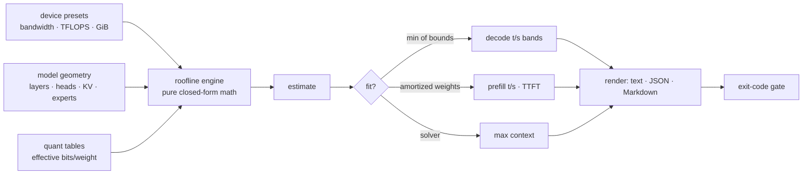

# inferest

[English](README.md) | [中文](README.zh.md) | [日本語](README.ja.md)

[](LICENSE) [](go.mod) [](CHANGELOG.md)  [](CONTRIBUTING.md)

**inferest：an open-source, zero-dependency CLI that estimates tokens-per-second bounds for LLM inference from device bandwidth, compute and model geometry — closed-form roofline math, so you can sanity-check hardware you don't own against models you haven't downloaded.**


```bash
git clone https://github.com/JaydenCJ/inferest && cd inferest
go build -o inferest ./cmd/inferest    # single static binary, stdlib only
```

> Pre-release: v0.1.0 is not tagged on a package registry yet; build from source as above (any Go ≥1.22).

## Why inferest?

Hardware buying for local LLM inference runs on vendor hype and forum anecdotes, yet the governing physics is embarrassingly simple: generating one token must stream every active weight byte plus the whole KV cache past the compute units, so decode speed is *memory bandwidth divided by bytes per token*, and batched prefill is *compute divided by FLOPs per token*. Benchmark harnesses answer precisely — but only after you own the GPU, download 40 GB of weights, and build the runtime; online VRAM calculators answer instantly but only whether it fits, saying nothing about speed; spec sheets quote sparse-marketing TFLOPS that never bound decode at all. inferest is the middle path nobody ships: it derives *fit, decode t/s, prefill t/s and time-to-first-token* — as honest conservative/expected/optimistic ranges with the binding constraint named — from three device numbers and a model's geometry, in milliseconds, offline, for hardware that may still be in a shop window. The same roofline math that HPC engineers trust, packaged as a buying-decision tool.

| | inferest | runtime bench harnesses | online VRAM calculators | spec-sheet guessing |
|---|---|---|---|---|
| Works without owning the hardware | ✅ | ❌ | ✅ | ✅ |
| Works without downloading the model | ✅ | ❌ | ✅ | ✅ |
| Predicts decode *speed*, not just fit | ✅ | ✅ measures | ❌ | ⚠️ wrong bound |
| Separates decode / prefill / TTFT | ✅ | ✅ | ❌ | ❌ |
| Honest uncertainty bands | ✅ | n/a | ❌ | ❌ |
| Max context that fits, solved | ✅ | ❌ | ⚠️ some | ❌ |
| Scriptable (JSON + exit-code gate) | ✅ | ⚠️ varies | ❌ | ❌ |
| Runtime dependencies | 0 | runtime + model | a browser | 0 |

<sub>Checked 2026-07-12: inferest imports the Go standard library only; a typical bench run needs the inference runtime, its GPU toolchain, and the full model weights.</sub>

## Features

- **Closed-form, not measured** — every number is derived from bandwidth, TFLOPS, memory and geometry; nothing to download, nothing to warm up, answers in milliseconds.
- **Both roofs, honestly labelled** — decode reports the bandwidth *and* compute bounds, takes the minimum, and names the binding constraint with the headroom multiple (spoiler: bandwidth wins ~25× on a typical GPU).
- **Uncertainty as a feature** — conservative / expected / optimistic bands (55–85% of spec bandwidth, 25–55% MFU) calibrated in `docs/method.md`; collapse them with `--bw-eff`/`--mfu` once you've measured your own stack.
- **Memory-fit solver** — weights (effective bits/weight, block overhead included), KV cache per token, documented overhead model; solves the largest context that fits, and `fit` exits 1 on failure for shell gates.
- **GQA, MHA and MoE aware** — KV cache sized from real head geometry; MoE splits footprint (all experts) from traffic (routed experts), which is exactly why a 47B-total MoE decodes like a 13B.
- **Presets you can argue with** — 19 devices from public spec sheets and 11 model classes whose declared parameter counts are cross-checked against their own geometry in the test suite; every number overridable per run.
- **Zero dependencies, fully offline** — Go standard library only, no telemetry, no network, ever; text, stable JSON (`schema_version: 1`) and PR-pasteable Markdown output.

## Quickstart

```bash
./inferest estimate --device apple-m4-pro --model 8b --quant q4
```

Real captured output:

```text
inferest estimate — 8b @ q4 on apple-m4-pro

device   apple-m4-pro · unified · 24.0 GiB · 273 GB/s · 18.4 TFLOPS fp16
model    8b · 8.03B params · dense · 32 layers · d_model 4096 · heads 32/kv 8
quant    q4 · 4.50 bits/weight effective · kv cache f16 · 128.0 KiB per context token

memory @ context 8,192
  weights         4.21 GiB
  kv cache        1.00 GiB
  overhead       598.2 MiB
  total           5.79 GiB / 24.00 GiB   FITS   (24.1% of memory)
  max context  ≈ 127,527 tokens on this device

decode speed, t/s (single stream)
  context            conservative     expected   optimistic
  empty                      33.2         42.3         51.4
  4,096 tokens               29.7         37.8         45.9
  8,192 tokens               26.9         34.2         41.5
  bound: memory bandwidth (compute headroom 10.6x)

prefill (1,024-token prompt)
  speed   281.7 / 450.7 / 619.8 t/s   (conservative / expected / optimistic)
  ttft    3.63 s / 2.27 s / 1.65 s
  bound: compute
```

Shortlist hardware for a bigger model:

```bash
./inferest compare --devices rtx-4090,apple-m4-max,a100-80gb --model 70b --quant q4
```

Real captured output:

```text
inferest compare — 70b @ q4 · context 8,192 · prompt 1,024

device                            fit     decode     range (c–o)    prefill       ttft
rtx-4090                 DOES NOT FIT          —               —          —          —
apple-m4-max                    85.3%       9.02       7.09–11.0      103.3     9.91 s
a100-80gb                       51.2%       33.7       26.5–40.9      876.1     1.17 s

decode/prefill/ttft are expected-efficiency figures at full context; — = does not fit
```

Gate a purchase decision in a script (`inferest fit` exits 1 on "does not fit"):

```bash
inferest fit --device rtx-3090 --model 24b --quant q4 --context 16384 && echo "shortlist it"
```

## Presets and overrides

`inferest devices`, `inferest models` and `inferest quants` list everything built in: 19 devices (data-center and consumer GPUs, unified-memory SoCs, SBCs, DDR4/DDR5 desktops), 11 model classes (1B–70B dense, MHA and GQA generations, two MoE classes), and quantization tables with *effective* bits per weight — a "4-bit" scheme costs 4.50 bits once block scales are counted, and ignoring that flatters every estimate by ~10%. Presets are inputs, not gospel: override any device number per run (`--bandwidth 504`), or describe hardware and models that don't exist yet with flags alone. Units are deliberate: memory in binary GiB, bandwidth in decimal GB/s, compute in dense FP16 TFLOPS — the conventions spec sheets actually use (`docs/method.md` §1).

| Key | Default | Effect |
|---|---|---|
| `--device` / `--model` | — | pick presets; both fully overridable |
| `--quant` | `q4` | weight scheme: `f32 f16 bf16 q8 q6 q5 q4 q3 q2` |
| `--kv-quant` | `f16` | KV-cache precision: `f32 f16 q8 q4` |
| `--context` | `8192` | context window to plan for (tokens) |
| `--prompt` | `min(1024, context)` | prompt length for prefill and TTFT |
| `--bandwidth` / `--tflops` / `--memory-gb` | preset | custom or overridden hardware |
| `--params --layers --d-model --heads --kv-heads --ffn --vocab` | preset | custom geometry (`--head-dim`, `--experts`, `--active-experts`, `--tied` optional) |
| `--bw-eff` / `--mfu` | bands | collapse an efficiency band to one measured value |
| `--format` | `text` | `text`, `json`, `markdown` (lists and `fit`: `text`, `json`) |

Exit codes: `0` ok · `1` fit verdict is "does not fit" · `2` usage error.

## Verification

This repository ships no CI; every claim above is verified by local runs:

```bash
go test ./...            # 88 deterministic tests, offline, < 5 s
bash scripts/smoke.sh    # end-to-end CLI check, prints SMOKE OK
```

## Architecture



## Roadmap

- [x] v0.1.0 — roofline decode/prefill bounds with efficiency bands, memory-fit solver with max-context, 19 device + 11 model presets with derived-parameter cross-checks, MoE support, `estimate`/`compare`/`fit` with JSON and Markdown, 88 tests + smoke script
- [ ] Batch-size axis: throughput roofline for continuous batching (decode → compute roof)
- [ ] Multi-GPU: tensor-parallel estimates with interconnect as a third roof
- [ ] `--gguf` header reader to pull geometry straight from a local model file
- [ ] Speculative-decoding modifier (acceptance-rate × draft-cost model)
- [ ] Community-maintained device table with per-entry spec-sheet citations

See the [open issues](https://github.com/JaydenCJ/inferest/issues) for the full list.

## Contributing

Issues, discussions and pull requests are welcome — see [CONTRIBUTING.md](CONTRIBUTING.md) for the local workflow (format, vet, tests, `SMOKE OK`). Good entry points are labelled [good first issue](https://github.com/JaydenCJ/inferest/issues?q=is%3Aissue+is%3Aopen+label%3A%22good+first+issue%22), and design questions live in [Discussions](https://github.com/JaydenCJ/inferest/discussions).

## License

[MIT](LICENSE)
