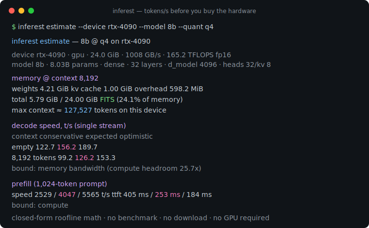
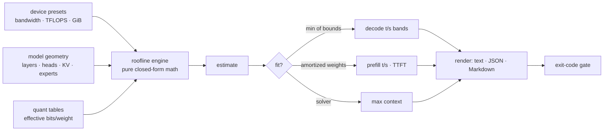

# inferest

[English](README.md) | [中文](README.zh.md) | [日本語](README.ja.md)

[](LICENSE) [](go.mod) [](CHANGELOG.md)  [](CONTRIBUTING.md)

**inferest：开源零依赖 CLI，根据设备内存带宽、算力与模型几何参数估算 LLM 推理的 tokens/s 上下界——纯闭式 roofline 数学，让你在没买硬件、没下模型的情况下就能做合理性验证。**



```bash
git clone https://github.com/JaydenCJ/inferest && cd inferest
go build -o inferest ./cmd/inferest    # single static binary, stdlib only
```

> 预发布说明：v0.1.0 尚未发布到任何包仓库；请按上述方式从源码构建（Go ≥1.22 即可）。

## 为什么选 inferest？

本地 LLM 推理的硬件选购一直靠厂商宣传和论坛传闻，但背后的物理规律其实简单得令人尴尬：生成一个 token 必须把全部激活权重字节加上整个 KV cache 从内存搬过一遍，所以解码速度就是*内存带宽除以每 token 字节数*，批量 prefill 则是*算力除以每 token FLOPs*。基准测试工具答得精确——但前提是你已经买了 GPU、下载了 40 GB 权重、编译好了运行时；在线 VRAM 计算器答得快，却只回答"放不放得下"，对速度只字不提；规格表上的稀疏营销 TFLOPS 更是根本约束不了解码。inferest 是没人做的中间路线：只凭三个设备数字和模型几何参数，就能在毫秒内离线推导出*显存适配、解码 t/s、prefill t/s 与首 token 延迟*——以诚实的保守/预期/乐观区间呈现，并指明真正的约束项，哪怕那台硬件还摆在商店橱窗里。这是 HPC 工程师信赖的 roofline 数学，包装成了一个购买决策工具。

| | inferest | 运行时基准工具 | 在线 VRAM 计算器 | 看规格表瞎猜 |
|---|---|---|---|---|
| 不需要拥有硬件 | ✅ | ❌ | ✅ | ✅ |
| 不需要下载模型 | ✅ | ❌ | ✅ | ✅ |
| 预测解码*速度*而不只是适配 | ✅ | ✅ 实测 | ❌ | ⚠️ 用错约束 |
| 区分 decode / prefill / TTFT | ✅ | ✅ | ❌ | ❌ |
| 诚实的不确定性区间 | ✅ | n/a | ❌ | ❌ |
| 解出能放下的最大上下文 | ✅ | ❌ | ⚠️ 部分 | ❌ |
| 可脚本化（JSON + 退出码闸门） | ✅ | ⚠️ 不一 | ❌ | ❌ |
| 运行时依赖 | 0 | 运行时 + 模型 | 浏览器 | 0 |

<sub>核对于 2026-07-12：inferest 只引用 Go 标准库；跑一次典型基准则需要推理运行时、GPU 工具链和完整模型权重。</sub>

## 功能特性

- **闭式推导，而非实测** — 每个数字都由带宽、TFLOPS、内存和几何参数推出；无需下载、无需预热，毫秒出结果。
- **两个屋顶，如实标注** — 解码同时给出带宽界与算力界，取最小值，并标明约束项及富余倍数（剧透：典型 GPU 上带宽以约 25 倍胜出）。
- **把不确定性当作特性** — 保守 / 预期 / 乐观区间（规格带宽的 55–85%，MFU 25–55%），校准依据见 `docs/method.md`；实测过自己的栈后可用 `--bw-eff`/`--mfu` 收敛为单值。
- **显存适配求解器** — 权重（有效 bits/weight，含分块开销）、每 token KV cache、有文档的开销模型；解出能放下的最大上下文，`fit` 失败时退出码为 1，可作 shell 闸门。
- **懂 GQA、MHA 和 MoE** — KV cache 按真实头部几何计算；MoE 把占用（全部专家）与流量（路由专家）分开——这正是 47B 总参数的 MoE 能解码得像 13B 的原因。
- **可以和它吵架的预设** — 19 个设备取自公开规格表，11 个模型类别的声明参数量在测试里与其自身几何推导交叉验证；每个数字都可按次覆盖。
- **零依赖，完全离线** — 只用 Go 标准库，无遥测，永不联网；输出 text、稳定 JSON（`schema_version: 1`）与可贴进 PR 的 Markdown。

## 快速上手

```bash
./inferest estimate --device apple-m4-pro --model 8b --quant q4
```

真实捕获的输出：

```text
inferest estimate — 8b @ q4 on apple-m4-pro

device   apple-m4-pro · unified · 24.0 GiB · 273 GB/s · 18.4 TFLOPS fp16
model    8b · 8.03B params · dense · 32 layers · d_model 4096 · heads 32/kv 8
quant    q4 · 4.50 bits/weight effective · kv cache f16 · 128.0 KiB per context token

memory @ context 8,192
  weights         4.21 GiB
  kv cache        1.00 GiB
  overhead       598.2 MiB
  total           5.79 GiB / 24.00 GiB   FITS   (24.1% of memory)
  max context  ≈ 127,527 tokens on this device

decode speed, t/s (single stream)
  context            conservative     expected   optimistic
  empty                      33.2         42.3         51.4
  4,096 tokens               29.7         37.8         45.9
  8,192 tokens               26.9         34.2         41.5
  bound: memory bandwidth (compute headroom 10.6x)

prefill (1,024-token prompt)
  speed   281.7 / 450.7 / 619.8 t/s   (conservative / expected / optimistic)
  ttft    3.63 s / 2.27 s / 1.65 s
  bound: compute
```

为更大的模型筛选硬件：

```bash
./inferest compare --devices rtx-4090,apple-m4-max,a100-80gb --model 70b --quant q4
```

真实捕获的输出：

```text
inferest compare — 70b @ q4 · context 8,192 · prompt 1,024

device                            fit     decode     range (c–o)    prefill       ttft
rtx-4090                 DOES NOT FIT          —               —          —          —
apple-m4-max                    85.3%       9.02       7.09–11.0      103.3     9.91 s
a100-80gb                       51.2%       33.7       26.5–40.9      876.1     1.17 s

decode/prefill/ttft are expected-efficiency figures at full context; — = does not fit
```

在脚本里给购买决策上闸门（`inferest fit` 在"放不下"时退出码为 1）：

```bash
inferest fit --device rtx-3090 --model 24b --quant q4 --context 16384 && echo "shortlist it"
```

## 预设与覆盖

`inferest devices`、`inferest models`、`inferest quants` 列出全部内置项：19 个设备（数据中心与消费级 GPU、统一内存 SoC、单板机、DDR4/DDR5 台式机）、11 个模型类别（1B–70B 稠密、MHA 与 GQA 世代、两个 MoE 类别），以及按*有效* bits/weight 计的量化表——所谓"4-bit"方案算上分块 scale 后实为 4.50 bit，忽略它会让每个估计虚高约 10%。预设是输入而非圣旨：任何设备数字都可按次覆盖（`--bandwidth 504`），也可以只用 flag 描述尚不存在的硬件和模型。单位是刻意选择的：内存用二进制 GiB，带宽用十进制 GB/s，算力用稠密 FP16 TFLOPS——正是规格表实际使用的约定（`docs/method.md` §1）。

| 键 | 默认值 | 作用 |
|---|---|---|
| `--device` / `--model` | — | 选择预设；两者均可完全覆盖 |
| `--quant` | `q4` | 权重方案：`f32 f16 bf16 q8 q6 q5 q4 q3 q2` |
| `--kv-quant` | `f16` | KV cache 精度：`f32 f16 q8 q4` |
| `--context` | `8192` | 规划的上下文窗口（token 数） |
| `--prompt` | `min(1024, context)` | 用于 prefill 与 TTFT 的提示词长度 |
| `--bandwidth` / `--tflops` / `--memory-gb` | 预设 | 自定义或覆盖硬件参数 |
| `--params --layers --d-model --heads --kv-heads --ffn --vocab` | 预设 | 自定义几何（`--head-dim`、`--experts`、`--active-experts`、`--tied` 可选） |
| `--bw-eff` / `--mfu` | 区间 | 把效率区间收敛为一个实测值 |
| `--format` | `text` | `text`、`json`、`markdown`（列表与 `fit`：`text`、`json`） |

退出码：`0` 正常 · `1` fit 判定为"放不下" · `2` 用法错误。

## 验证

本仓库不附带 CI；上述所有断言均由本地运行验证：

```bash
go test ./...            # 88 deterministic tests, offline, < 5 s
bash scripts/smoke.sh    # end-to-end CLI check, prints SMOKE OK
```

## 架构



## 路线图

- [x] v0.1.0 — 带效率区间的 roofline 解码/prefill 界、含最大上下文的显存适配求解器、19 设备 + 11 模型预设（附推导参数交叉验证）、MoE 支持、`estimate`/`compare`/`fit` 及 JSON/Markdown 输出、88 个测试 + smoke 脚本
- [ ] batch 维度：面向 continuous batching 的吞吐 roofline（解码转向算力屋顶）
- [ ] 多 GPU：张量并行估算，把互连当作第三个屋顶
- [ ] `--gguf` 头部读取器，直接从本地模型文件提取几何参数
- [ ] 投机解码修正项（接受率 × 草稿开销模型）
- [ ] 社区维护的设备表，逐条附规格表出处

完整列表见 [open issues](https://github.com/JaydenCJ/inferest/issues)。

## 参与贡献

欢迎 issue、讨论与 PR——本地工作流（格式化、vet、测试、`SMOKE OK`）见 [CONTRIBUTING.md](CONTRIBUTING.md)。入门任务标注为 [good first issue](https://github.com/JaydenCJ/inferest/issues?q=is%3Aissue+is%3Aopen+label%3A%22good+first+issue%22)，设计讨论请到 [Discussions](https://github.com/JaydenCJ/inferest/discussions)。

## 许可证

[MIT](LICENSE)
